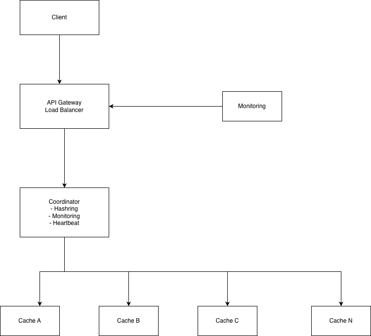

# distcache
A simple distributed caching system (redis lite) with load balancing.

# System Architecture Diagrams

// Happy path : GET
Client -> API Gateway -> Coordinator -> Cache Node -> Return Value

// Node Failure 
Cache Node(stops heartbeat)  -> Coordinator (detects failure) -> Coordinator redistributes keys - > Keys reassigned to other nodes

## Future Improvements : TODO
- Add Coordinator redundancy
- Implement ML based eviction policy
- Implement metric dashboard